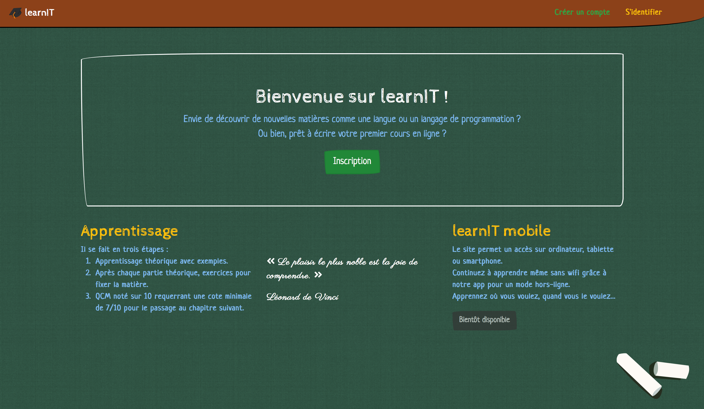

# learnIT

learnIT is a learning site about everything for everyone making course creation easy.    

This is my graduation work at the Haute École en Hainaut.

The site is developped with the Laravel framework and will offer an Android application for offline access.

---

## Todo list

Display the list

- [x] Course creation
- [x] Course edition
- [x] Unrated quiz
- [x] Quiz rated out of 10
- [x] Next chapter unlocked from 7/10
- [x] Various MCQs available, some of which will be chosen at random
	- [x] Import a quiz from a file
- [x] Custom QCM correction based on response _(semi-automatic)_
- [x] Chapter and Course Success Trophies
- [x] Statistics
	- [x] for each student
	- [x] for the course creator
- [x] Save from a `.csv` file and send mails automatically in this case
- [x] Possibility to hide questions
- [ ] Generate a PDF from selected chapter(s)
- [ ] Different levels of difficulty depending on the age or level of the user
- [ ] Bonus
	- [ ] Choice of the difficulty of the questions, as well as management of their weighting
	- [ ] Creating of an Android mobile application for offline access

### Added after the defence

- [ ] Add an administrator role _(kind of like the one of Wikipedia)_
- [ ] Add course verification by the administrators
- [ ] Add RGPD support _(possibility to download personal data, etc.)_
- [ ] Add image support in courses
- [ ] Add more security _(against multiple signins, DB overload...)_

